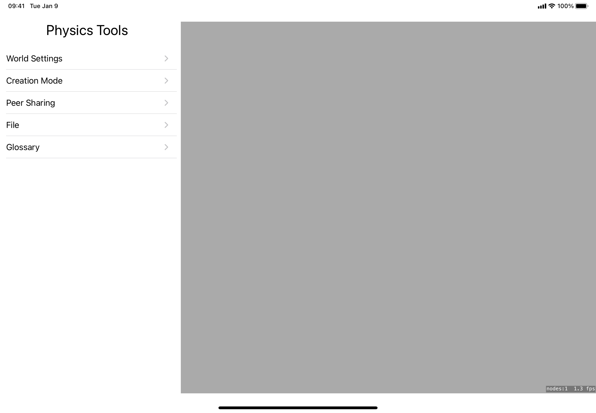

# PhysicsTools
### This project is my final project for DePaul's CSC-491
Important note, the code is GPL with exception to any of the sprites that I do make any claim to. Hopefully I will replacement soon with creative commons alternatives, but that is not the case as of this writing. The code was entirely written by me. 

This project uses: 
- [SpriteKit](https://developer.apple.com/documentation/spritekit/) 
  - Drawing
- [CoreMotion](https://developer.apple.com/documentation/coremotion)
  - Allowing interaction via gyro
- [SwiftUI](https://developer.apple.com/xcode/swiftui/)
    - General UI
- [MultiPeerConnectivity](https://developer.apple.com/documentation/multipeerconnectivity)
    - Experimental multiplayer
- JSON
  - Level definitions
- Dependency Injection
  - Code from DITranquillity project, as the time this project was created that project did not work the way I wanted to so I took the relevant section and pasted it into my with modifications. The code relies on Property wrappers and dictionaries with type as the key, the project I referenced does much more than I needed. Additionally my understanding of SwiftUI was limited and I understand some of this might me done differently by someone more experienced. 
- Art assets from a famous game. Was put in place for the assignment not to be dull but I intent to replace them.
- Zip 
  - zip utility to store various sample levels to be decompressed to user directory at start up
  - Integration with the File app by exposing the contents of the directory to the File app so user can share their levels and place them in there for loading

## Motivation
This Class was taken at the same time as GAM-450 (Physics for Game Developers), so I wanted to take advantage of the concepts from that class in this one. Uses SwiftUI as the main framework for the application with SpriteKit as the sub view to show the simulation. Di allowed shared components of the application to communicate without having to wire them up at higher levels and pass down objects. Environmental objects in SwiftUI could have solved some of these, but with limited time in class I decided with a different approach. 

## Startup UI
- World Settings
